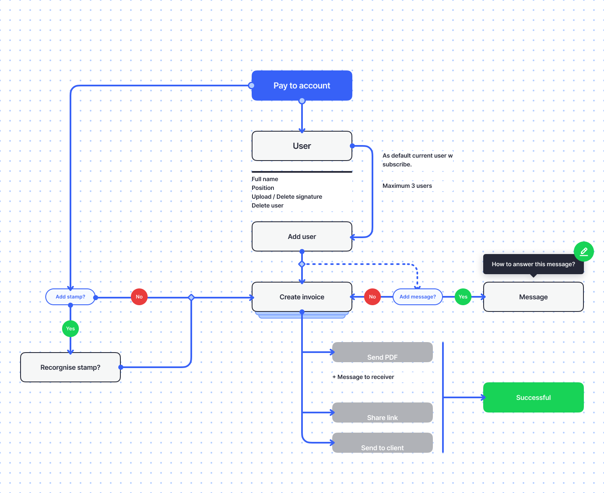
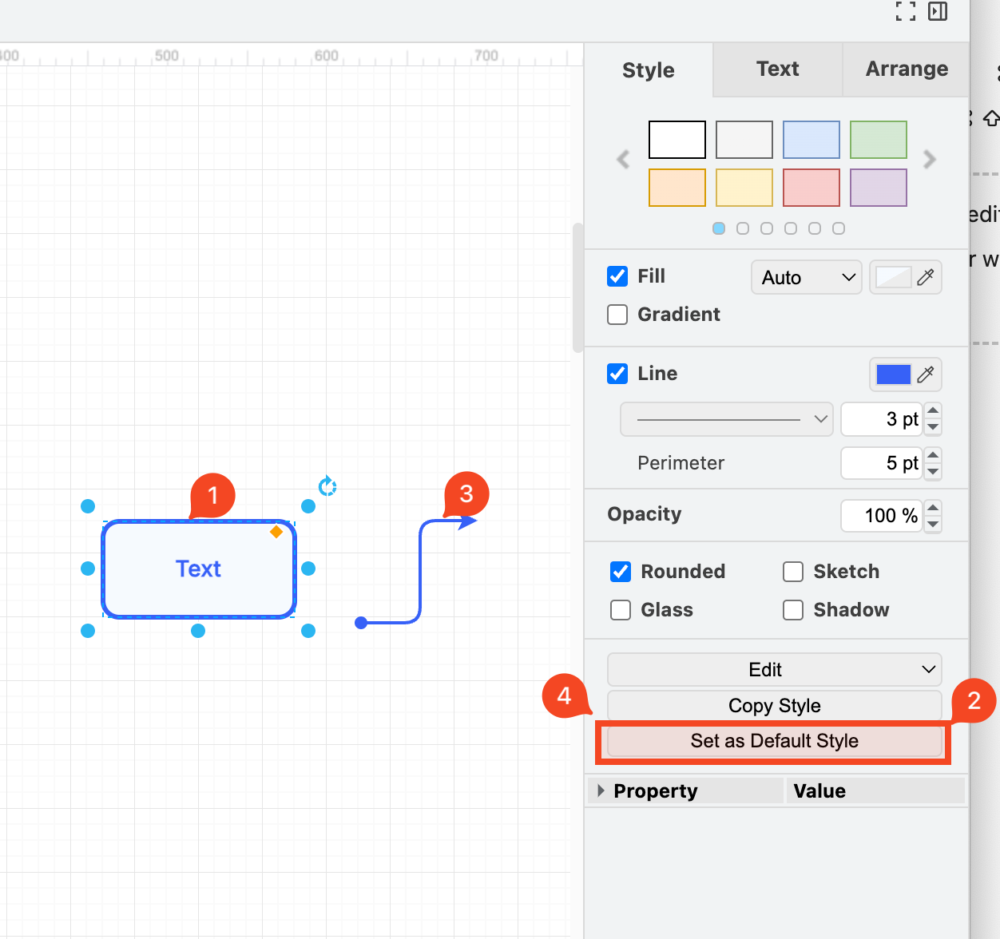
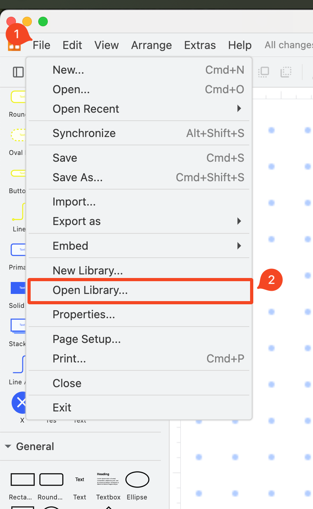

# DRAWLIB

Welcome to DRAWLIB, a comprehensive library for creating and managing diagrams using draw.io. This README will guide you through the setup, usage, and contribution process for this project.




## Introduction

DRAWLIB is designed to simplify the process of creating and managing diagrams with draw.io. Whether you're a developer, designer, or project manager, this library provides the tools you need to create beautiful and functional diagrams with ease.

## Features

- **Easy Integration**: Seamlessly integrate draw.io into your projects.
- **Customizable Templates**: Use and create templates to standardize your diagrams.

## Get Started

To get started with DRAWLIB, follow these steps:

1. Download this repos by click on "Get Code" and Download as ZIP above or on the release

2. Using `template_empty.drawio` to get start or create new projects copy code below
```
%3CmxGraphModel%3E%3Croot%3E%3CmxCell%20id%3D%220%22%2F%3E%3CmxCell%20id%3D%221%22%20parent%3D%220%22%2F%3E%3CmxCell%20id%3D%222%22%20value%3D%22Text%22%20style%3D%22rounded%3D1%3Bspacing%3D5%3BwhiteSpace%3Dwrap%3BarcSize%3D17%3BfontFamily%3DInter%3BtextShadow%3D0%3Bhtml%3D1%3Bglass%3D0%3Bshadow%3D0%3BperimeterSpacing%3D5%3BstrokeWidth%3D3%3BstrokeColor%3D%233761F7%3BfontSource%3Dhttps%253A%252F%252Ffonts.googleapis.com%252Fcss%253Ffamily%253DInter%3BfontStyle%3D1%3BfontSize%3D14%3BfillColor%3Dlight-dark(%23F6FAFF%2C%23EDEDED)%3BfontColor%3D%233761F7%3BlabelBackgroundColor%3D%23F6FAFF%3B%22%20vertex%3D%221%22%20parent%3D%221%22%3E%3CmxGeometry%20x%3D%22459.9999999999998%22%20y%3D%22460%22%20width%3D%22120%22%20height%3D%2260%22%20as%3D%22geometry%22%2F%3E%3C%2FmxCell%3E%3CmxCell%20id%3D%223%22%20value%3D%22%22%20style%3D%22endArrow%3Dclassic%3Bhtml%3D1%3Brounded%3D1%3BstrokeColor%3Dlight-dark(%233761f7%2C%20%23ededed)%3BstrokeWidth%3D2%3Balign%3Dcenter%3BverticalAlign%3Dmiddle%3BfontFamily%3DInter%3BfontSize%3D11%3BfontColor%3Ddefault%3BlabelBackgroundColor%3Ddefault%3BedgeStyle%3DelbowEdgeStyle%3BsourcePerimeterSpacing%3D-6%3Bspacing%3D5%3BtargetPerimeterSpacing%3D-4%3BflowAnimation%3D0%3Bshadow%3D0%3BstartArrow%3Doval%3BstartFill%3D1%3BfontSource%3Dhttps%253A%252F%252Ffonts.googleapis.com%252Fcss%253Ffamily%253DInter%3B%22%20edge%3D%221%22%20parent%3D%221%22%3E%3CmxGeometry%20width%3D%2250%22%20height%3D%2250%22%20relative%3D%221%22%20as%3D%22geometry%22%3E%3CmxPoint%20x%3D%22622%22%20y%3D%22524%22%20as%3D%22sourcePoint%22%2F%3E%3CmxPoint%20x%3D%22695%22%20y%3D%22460%22%20as%3D%22targetPoint%22%2F%3E%3C%2FmxGeometry%3E%3C%2FmxCell%3E%3C%2Froot%3E%3C%2FmxGraphModel%3E
```
Paste it into Draw.io then select Rectangle -> Set as Default Style, Line -> Set as Default Style Audre


Open this library to import all the rectangle and elements


